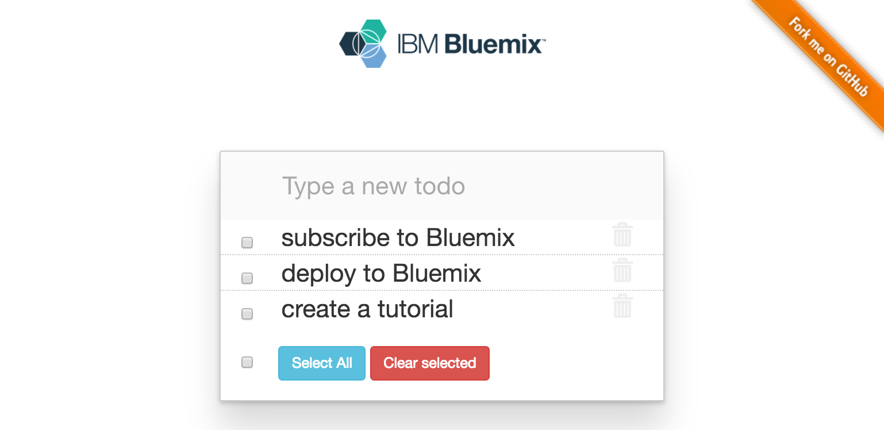

# Introduction

In this lab, you’ll gain a high level understanding of the architecture, features, and development concepts related to the Cloud Foundry runtimes and Bluemix service. Throughout the lab, you’ll create a sample application and then edit it using a Web IDE based on Orion.

# Objective

In the following lab, you will learn:

+ How to deploy a new Cloud Foundry app based on Node.js runtime
+ How to set up a source code repository to collaborate
+ How to edit the code of your application from a Web IDE
+ How to manage Continuous Integration and Deployment

# Pre-Requisites

+ Get a [Bluemix IBM id](https://bluemix.net), or use an existing account.

# Steps

1. [Create a new web application](#step-1---create-a-new-web-application)
2. [Add Git support](#step-2---add-git-support)
3. [Edit the code](#step-3---edit-the-code)
4. [Push your changes](#step-4---push-your-changes)
5. [See your changes](#step-5---see-your-changes)
6. [(Optional) Edit the code using the CloudFoundry command line](#step-6---edit-the-code-using-the-CloudFoundry-command-line)

# Step 1 - Create a new web application

1. Log in to [Bluemix console](https://bluemix.net).

1. Select the Region (e.g. United Kingdom) where you want to create your application.

1. Go to the Bluemix **Catalog**.

1. In the Compute category, select **Cloud Foundry Apps**

1. Create a new app with the ***SDK for Node.js***.

1. Give your app a unique name and unique host (e.g. todo-[your-initials])

1. View your application.

The SDK for Node.js created a simple "Hello World!" web app that will become our starting point.

# Step 2 - Add Git support

Now let's add a source code repository and an automatic build pipeline to our project.

1. In your application **Overview** page, click the **Add Git Repo and Pipeline** button.

1. Leave the default options selected and continue.

  Bluemix DevOps creates a Git repository for your application, puts in it the starter code for the "Hello World!" application, and defines a build pipeline so that your app gets automatically redeployed after every push.

# Step 3 - Edit the code 

We'll now see how you can easily edit, using only a browser, the code of your application. 

1. From the **Overview** page, click on the **Edit Code** button to go to Jazz Hub

1. Navigate to the public/index.html file

1. Change the "Hello World!" text by something of your choice (ex: "Hello CAF!")

1. Click **File** and **Save** to save your changes

# Step 4 - Push your changes

Here, we'll see how you can use git commands inside Jazz Hub to deal with group projects.
You should still be in the IBM Bluemix DevOps Services.

1. Click on the GIT icon on the left-hand side, under the edit code button, your repository is loading
2. On the right, you can see the files that you've edited, add a commit message to describe your changes (i.e. "changed welcome message")
3. Click **Commit** on the right-hand side
4. Your changes now appear in the left-hand side and are waiting to be pushed. Click **Push**

Pushing your changes triggered a new build and deployment of the app, you can navigate to the **BUILD & DEPLOY** tab on the top-right corner if you want to see the piepline. 

# Step 5 - See your changes

1. Navigate to the **Overview** of your app on the Bluemix console. 
2. Wait for the status of the app to be running
3. Click on **View App**
4. You should see your changes appear

Note: You can follow the build and deploy phase by clicking on "Logs" on the left column, this is useful if you have a need to debug your application. 

Congratulations! You completed this lab. You can get familiar with the application code content.

# Step 6 - Edit the code using the CloudFoundry command line

This step will erase your previous modifications, this is to show you how you can edit from your computer if you're more comfortable using your own developing tools. 

1. Navigate to the **Getting Started** page of your application 
2. Follow the steps, this will show how you can easily download the Hello World application to your computer, edit it locally and then push it back to Bluemix

## Source code

### Back-end

| File | Description |
| ---- | ----------- |
|**package.json**|Lists the node.js dependencies|
|**.cfignore**|List of files and directories ignored when calling **cf push**. Typically we ignore everything that can be retrieved with bower or npm. This speeds up the push process.|
|**manifest.yml**|Used by Cloud Foundry when pushing the application to define the application environment, connected services, number of instances, etc.|
|**app.js**|Web app backend entry point. It initializes the environment and imports the Todo API endpoints|
|**todos.js**|Todo API implementation. It declares endpoints for PUT/GET/DELETE (create/retrieve/delete) and handles the *in-memory* storage.

### Front-end

| File | Description |
| ---- | ----------- |
|**.bowerrc**|Configuration file for the [bower](http://bower.io/) web package manager to put our web dependencies under public/vendor|
|**bower.json**|Web dependencies (bootstrap, angular)|
|**index.html**|Web front-end implementation. It displays the todo list and has a form to submit new todos.|
|**todo.js**|Declares the Angular app|
|**todo.service.js**|Implements the connection between the front-end and the back-end. It has methods to create/retrieve/delete Todos|
|**todo.controller.js**|Controls the main view, loading the current todos and adding/removing todos by delegating to the Todo service|

# Resources

For additional resources pay close attention to the following:

- [GitHub Guides](https://guides.github.com/)

## Credits

Based on [scotch-io/node-todo](https://github.com/scotch-io/node-todo)
